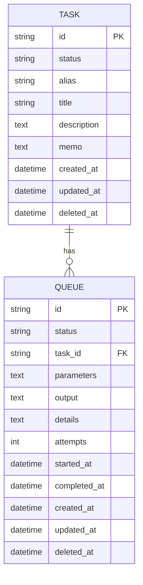

# TaskStore Package Overview

## Introduction
`dracory/taskstore` is a robust, asynchronous durable task queue package designed to offload time-consuming or resource-intensive operations from the main application. It leverages a durable database (SQLite, MySQL, or PostgreSQL) for persistence.

## Core Concepts

### 1. Store
The `Store` is the central component that manages the connection to the database and provides methods to interact with tasks and queues. It handles:
- Database connection and migration (`AutoMigrate`).
- Task management (Create, Update, Delete, Find).
- Queue management (Enqueue, Process, Status updates).

### 2. Task
A `Task` represents a definition of a unit of work. It is identified by a unique **Alias**.
- **Properties**: Alias, Title, Description, Status (Active/Canceled).
- **Handler**: Each task is associated with a `TaskHandlerInterface` implementation that defines the actual logic (`Handle` method).

### 3. Queue
A `Queue` item represents a specific instance of a task to be executed.
- **Properties**:
    - `ID`: Unique identifier.
    - `TaskID`: Reference to the parent Task.
    - `Status`: Current state (Queued, Running, Success, Failed, Canceled, Paused).
    - `Parameters`: JSON-encoded parameters for the task execution.
    - `Output`: Result or logs from the execution.
    - `Attempts`: Number of execution attempts.
    - `Timestamps`: CreatedAt, StartedAt, CompletedAt.

### 4. Recurrence Rules
The package supports recurring tasks via `RecurrenceRule`.
- **Frequency**: Secondly, Minutely, Hourly, Daily, Weekly, Monthly, Yearly.
- **Configuration**: Interval, Start/End times, Days of Week/Month.
- **Logic**: `NextRunAt` calculates the next execution time based on the rule and current time.

## Architecture

- **Interfaces**: `interfaces.go` defines the contracts for Tasks, Queues, and the Store, promoting modularity and testability.
- **Persistence**: Uses `goqu` for SQL generation and `sb` (likely a database helper) for execution, supporting multiple dialects.
- **Worker**: The `QueueRunGoroutine` method starts a background worker that polls the database for `queued` tasks and processes them.
- **Resilience**: Handles timeouts (unstuck mechanism) and retries (via `Attempts`).

## Usage Flow
1. **Setup**: Initialize `Store` with database connection.
2. **Define Task**: Create a struct implementing `TaskHandlerInterface`.
3. **Register**: Add the handler to the store using `TaskHandlerAdd`.
4. **Enqueue**: Trigger a task execution via `TaskEnqueueByAlias`.
5. **Process**: Run `QueueRunGoroutine` to start processing tasks.

## Data Model
- **Tasks Table**: Stores task definitions.
- **Queues Table**: Stores task execution instances (the queue).

