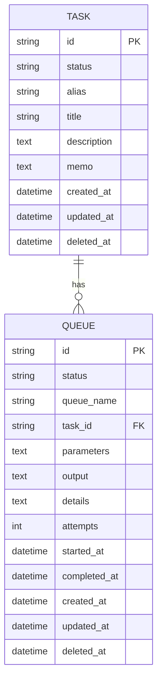

# TaskStore Package Overview

## Introduction
`dracory/taskstore` is a robust, asynchronous durable task queue package designed to offload time-consuming or resource-intensive operations from the main application. It leverages a durable database (SQLite, MySQL, or PostgreSQL) for persistence.

## Core Concepts

### 1. Store
The `Store` is the central component that manages the connection to the database and provides methods to interact with task definitions and task queues. It handles:
- Database connection and migration (`AutoMigrate`)
- Task definition management (Create, Update, Delete, Find)
- Task queue management (Enqueue, Process, Status updates)
- Concurrency control and error handling

### 2. Task Definition
A task definition represents a unit of work. It is identified by a unique **Alias**.
- **Properties**: Alias, Title, Description, Status (Active/Canceled)
- **Handler**: Each task definition is associated with a `TaskHandlerInterface` implementation that defines the actual logic (`Handle` method)
- **Context Support**: Handlers can optionally implement `TaskHandlerWithContext` for cancellation support

### 3. Task Queue
A task queue item represents a specific instance of a task to be executed.
- **Properties**:
    - `ID`: Unique identifier
    - `TaskID`: Reference to the parent Task
    - `Status`: Current state (Queued, Running, Success, Failed, Canceled, Paused)
    - `Parameters`: JSON-encoded parameters for the task execution
    - `Output`: Result or logs from the execution
    - `Attempts`: Number of execution attempts
    - `Timestamps`: CreatedAt, StartedAt, CompletedAt

### 4. Queue Processing Modes

**TaskQueueRunDefault** - Processes the default queue serially:
```go
store.TaskQueueRunDefault(ctx, 10, 2) // Process every 10s, unstuck after 2 mins
```

**TaskQueueRunSerial** - Processes named queue tasks one at a time:
```go
store.TaskQueueRunSerial(ctx, "emails", 10, 2)
```

**TaskQueueRunConcurrent** - Processes multiple tasks in parallel with concurrency limits:
```go
store.TaskQueueRunConcurrent(ctx, "background-jobs", 10, 2)
// Respects MaxConcurrency setting (default: 10)
```

## Key Features

### Atomic Task Claiming
Tasks are claimed atomically using `SELECT FOR UPDATE` within database transactions, preventing race conditions where multiple workers might process the same task simultaneously.

### Concurrency Control
- Configurable via `MaxConcurrency` (default: 10)
- Semaphore-based limiting prevents resource exhaustion
- Automatic backpressure when limit is reached

### Graceful Shutdown
```go
store.TaskQueueStop()                // Stop default queue
store.TaskQueueStopByName("emails")  // Stop named queue
// Both wait for all running tasks to complete
```

### Error Handling
```go
store.SetErrorHandler(func(queueName, taskID string, err error) {
    log.Printf("[ERROR] Queue: %s, Task: %s, Error: %v", queueName, taskID, err)
    metrics.RecordTaskError(queueName, taskID)
})
```

### Context Propagation
Handlers implementing `TaskHandlerWithContext` receive context for cancellation:
```go
func (h *MyHandler) HandleWithContext(ctx context.Context) bool {
    select {
    case <-ctx.Done():
        return false // Task cancelled
    default:
        // Process task
        return true
    }
}
```

## Architecture

- **Interfaces**: Promote modularity and testability
- **Persistence**: Uses `goqu` for SQL generation, supporting SQLite, MySQL, PostgreSQL
- **Worker**: Background goroutine polls database for queued tasks
- **Resilience**: Handles timeouts (unstuck mechanism) and retries (via `Attempts`)
- **Goroutine Management**: Tracked with `sync.WaitGroup` for proper shutdown

## Usage Flow
1. **Setup**: Initialize `Store` with database connection and options
2. **Define Task**: Create a struct implementing `TaskHandlerInterface`
3. **Register**: Add the handler to the store using `TaskHandlerAdd`
4. **Enqueue**: Trigger a task execution via `TaskDefinitionEnqueueByAlias(queueName, alias, parameters)`
5. **Process**: Run `TaskQueueRunDefault`, `TaskQueueRunSerial`, or `TaskQueueRunConcurrent`

## Data Model


