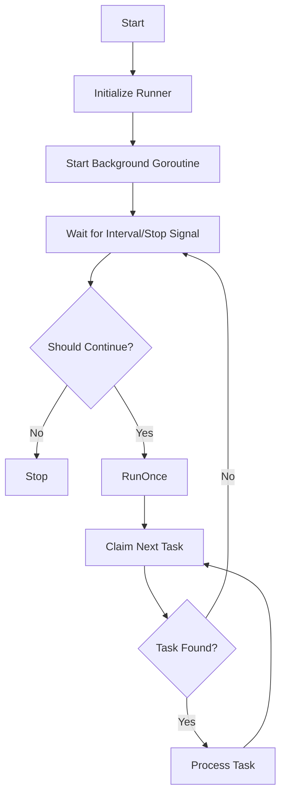
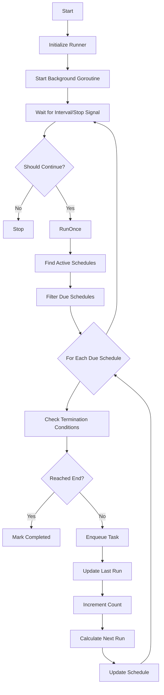

# Runners

This document explains how the two runner components work in the taskstore package: the **Task Queue Runner** and the **Schedule Runner**.

## Overview

The taskstore package provides two background runner components that enable automated task processing:

1. **Task Queue Runner** ([task_queue_runner.go](file:///d:/PROJECTs/_modules_dracory/taskstore/task_queue_runner.go)) - Continuously processes queued tasks from a specific queue
2. **Schedule Runner** ([schedule_runner.go](file:///d:/PROJECTs/_modules_dracory/taskstore/schedule_runner.go)) - Monitors schedules and enqueues tasks based on recurrence rules

Both runners follow a similar architectural pattern with lifecycle management, configurable intervals, and graceful shutdown capabilities.

---

## Task Queue Runner

### Purpose

The Task Queue Runner is responsible for continuously claiming and processing tasks from a specific queue. It runs in the background, polling the queue at regular intervals and executing tasks as they become available.

### Architecture



### Configuration

The `TaskQueueRunnerOptions` struct configures the runner:

| Field | Type | Default | Description |
|-------|------|---------|-------------|
| `IntervalSeconds` | `int` | `10` | How often to check for new tasks (in seconds) |
| `UnstuckMinutes` | `int` | `1` | Minutes before a stuck task is reclaimed |
| `QueueName` | `string` | `DefaultQueueName` | The queue to process tasks from |
| `Logger` | `*log.Logger` | `nil` | Optional logger for debugging |

### Creating a Runner

```go
runner := NewTaskQueueRunner(store, TaskQueueRunnerOptions{
    IntervalSeconds: 10,
    UnstuckMinutes:  1,
    QueueName:       "my-queue",
    Logger:          log.Default(),
})
```

### Lifecycle Methods

#### `Start(ctx context.Context)`

Starts the runner in a background goroutine. The runner will:
1. Use atomic operations to ensure only one instance runs at a time
2. Create a ticker that fires every `IntervalSeconds`
3. Continuously call `RunOnce()` to process tasks
4. Stop when the context is cancelled, `Stop()` is called, or the stop channel receives a signal

**Key Features:**
- Thread-safe start using `atomic.Bool.CompareAndSwap`
- Non-blocking - returns immediately after spawning goroutine
- Respects context cancellation for graceful shutdown

#### `Stop()`

Signals the runner to stop gracefully by sending to the stop channel. This is non-blocking and safe to call multiple times.

#### `IsRunning() bool`

Returns whether the runner is currently active.

#### `RunOnce(ctx context.Context) error`

Processes all available tasks in the queue in a single pass. This method:
1. Normalizes the queue name
2. Enters an infinite loop that:
   - Checks if the context is cancelled
   - Claims the next available task using `TaskQueueClaimNext`
   - If no task is found, returns `nil`
   - If a task is found, processes it using `TaskQueueProcessTask`
   - Logs any errors but continues processing

**Important:** This method processes tasks continuously until the queue is empty, not just one task.

### Internal Implementation Details

#### Atomic State Management

The runner uses `sync/atomic.Bool` to manage its running state, ensuring thread-safe start/stop operations without explicit locks.

#### Stop Channel

A buffered channel (`chan struct{}`) with capacity 1 is used for stop signals. The buffer prevents blocking when multiple stop signals are sent.

#### Error Handling

- Errors during task processing are logged but don't stop the runner
- Context cancellation errors are returned immediately
- The runner continues processing even if individual tasks fail

---

## Schedule Runner

### Purpose

The Schedule Runner monitors active schedules and enqueues tasks based on their recurrence rules. It's responsible for:
- Initializing `next_run_at` for new schedules
- Finding schedules that are due to run
- Enqueuing tasks for due schedules
- Updating schedule execution counts and next run times
- Marking completed schedules

### Architecture



### Configuration

The `ScheduleRunnerOptions` struct configures the runner:

| Field | Type | Default | Description |
|-------|------|---------|-------------|
| `IntervalSeconds` | `int` | `60` | How often to check schedules (in seconds) |
| `Logger` | `*log.Logger` | `nil` | Optional logger for debugging |

### Creating a Runner

```go
runner := NewScheduleRunner(store, ScheduleRunnerOptions{
    IntervalSeconds: 60,
    Logger:          log.Default(),
})
```

### Lifecycle Methods

#### `Start(ctx context.Context)`

Starts the runner in a background goroutine. Similar to the Task Queue Runner, it:
1. Uses atomic operations for thread-safe start
2. Creates a ticker that fires every `IntervalSeconds`
3. Continuously calls `RunOnce()` to process schedules
4. Stops on context cancellation or stop signal

#### `Stop()`

Signals the runner to stop gracefully.

#### `IsRunning() bool`

Returns whether the runner is currently active.

#### `SetInitialRuns(ctx context.Context) error`

Initializes the `next_run_at` field for all active schedules that don't have it set. This should be called once when the application starts to ensure all schedules have a calculated next run time.

**Usage:**
```go
if err := runner.SetInitialRuns(ctx); err != nil {
    log.Printf("Error setting initial runs: %v", err)
}
```

#### `RunOnce(ctx context.Context) error`

Processes all due schedules in a single pass. This method:
1. Finds all active schedules that are due to run
2. For each due schedule:
   - Verifies it hasn't reached termination conditions
   - Enqueues a task based on the schedule's task definition
   - Updates the schedule's execution metadata
   - Marks as completed if termination conditions are met

### Internal Implementation Details

#### Schedule Filtering Logic

The `findActiveSchedulesToBeRun` method performs several important checks:

1. **Completion Detection**: Schedules that have reached their end date or max executions are marked as `completed`
2. **Next Run Initialization**: Schedules with `NULL_DATETIME` for `next_run_at` are initialized
3. **Due Check**: Only schedules where `IsDue()` returns true are included

#### Schedule Execution Flow

When running a schedule ([runSchedule](file:///d:/PROJECTs/_modules_dracory/taskstore/schedule_runner.go#L179-L214)):

1. **Double-check termination conditions** - Ensures the schedule hasn't reached its end
2. **Verify schedule is due** - Prevents duplicate execution
3. **Fetch task definition** - Retrieves the task definition by ID
4. **Enqueue task** - Creates a new queued task using `TaskDefinitionEnqueueByAlias`
5. **Update schedule metadata**:
   - `UpdateLastRunAt()` - Sets the last run timestamp
   - `IncrementExecutionCount()` - Increments the execution counter
   - `UpdateNextRunAt()` - Calculates the next run time based on recurrence rules
6. **Check completion** - Marks as completed if termination conditions are now met
7. **Persist changes** - Saves the updated schedule to the database

#### Error Handling

- Individual schedule errors are logged but don't stop processing other schedules
- Missing task definitions are logged as warnings
- Database errors during updates are logged but don't crash the runner

---

## Common Patterns

Both runners share several design patterns:

### Thread-Safe Lifecycle

```go
// Start uses CompareAndSwap to prevent multiple instances
if !r.running.CompareAndSwap(false, true) {
    return
}
```

### Graceful Shutdown

```go
select {
case <-ticker.C:
    continue
case <-ctx.Done():
    return
case <-r.stopCh:
    return
}
```

### Optional Logging

```go
func (r *runner) logf(format string, args ...interface{}) {
    if r.opts.Logger != nil {
        r.opts.Logger.Printf(format, args...)
    }
}
```

---

## Usage Example

Here's a complete example of using both runners together:

```go
package main

import (
    "context"
    "log"
    "os"
    "os/signal"
    "syscall"
    "time"
    
    "github.com/dracory/taskstore"
)

func main() {
    ctx, cancel := context.WithCancel(context.Background())
    defer cancel()
    
    // Create store
    store, err := taskstore.NewStore(taskstore.NewStoreOptions{
        DatabaseType: "sqlite",
        DatabaseDSN:  "taskstore.db",
    })
    if err != nil {
        log.Fatal(err)
    }
    
    // Create and start schedule runner
    scheduleRunner := taskstore.NewScheduleRunner(store, taskstore.ScheduleRunnerOptions{
        IntervalSeconds: 60,
        Logger:          log.Default(),
    })
    
    // Initialize next run times for existing schedules
    if err := scheduleRunner.SetInitialRuns(ctx); err != nil {
        log.Printf("Error setting initial runs: %v", err)
    }
    
    scheduleRunner.Start(ctx)
    defer scheduleRunner.Stop()
    
    // Create and start task queue runner
    queueRunner := taskstore.NewTaskQueueRunner(store, taskstore.TaskQueueRunnerOptions{
        IntervalSeconds: 10,
        UnstuckMinutes:  1,
        QueueName:       "default",
        Logger:          log.Default(),
    })
    
    queueRunner.Start(ctx)
    defer queueRunner.Stop()
    
    // Wait for interrupt signal
    sigCh := make(chan os.Signal, 1)
    signal.Notify(sigCh, os.Interrupt, syscall.SIGTERM)
    
    <-sigCh
    log.Println("Shutting down runners...")
    
    // Cancel context to stop runners
    cancel()
    
    // Wait for runners to stop
    for scheduleRunner.IsRunning() || queueRunner.IsRunning() {
        time.Sleep(100 * time.Millisecond)
    }
    
    log.Println("Runners stopped")
}
```

---

## Best Practices

### Interval Configuration

- **Task Queue Runner**: Use shorter intervals (5-10 seconds) for responsive task processing
- **Schedule Runner**: Use longer intervals (60+ seconds) since schedules typically run less frequently

### Error Handling

Both runners log errors but continue processing. Monitor logs for:
- Task processing failures
- Schedule execution errors
- Database connection issues

### Graceful Shutdown

Always use context cancellation and wait for runners to stop:

```go
cancel()
for runner.IsRunning() {
    time.Sleep(100 * time.Millisecond)
}
```

### Multiple Queues

To process multiple queues, create separate Task Queue Runner instances:

```go
defaultRunner := taskstore.NewTaskQueueRunner(store, taskstore.TaskQueueRunnerOptions{
    QueueName: "default",
})

priorityRunner := taskstore.NewTaskQueueRunner(store, taskstore.TaskQueueRunnerOptions{
    QueueName: "priority",
    IntervalSeconds: 5, // Check more frequently
})
```

### Initialization

Always call `SetInitialRuns()` on the Schedule Runner before starting it to ensure all schedules have their next run times calculated.

---

## See Also

- [Schedules](file:///d:/PROJECTs/_modules_dracory/taskstore/docs/schedules.md) - Detailed schedule documentation
- [Task Queues](file:///d:/PROJECTs/_modules_dracory/taskstore/docs/task-queues.md) - Task queue documentation
- [Task Definitions](file:///d:/PROJECTs/_modules_dracory/taskstore/docs/task-definitions.md) - Task definition documentation
- [Recurrence Rules](file:///d:/PROJECTs/_modules_dracory/taskstore/docs/recurrence_rules.md) - Recurrence rule documentation
